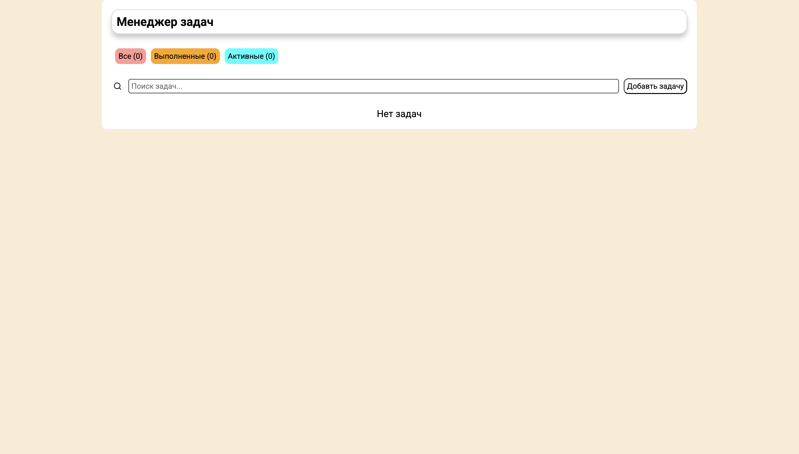
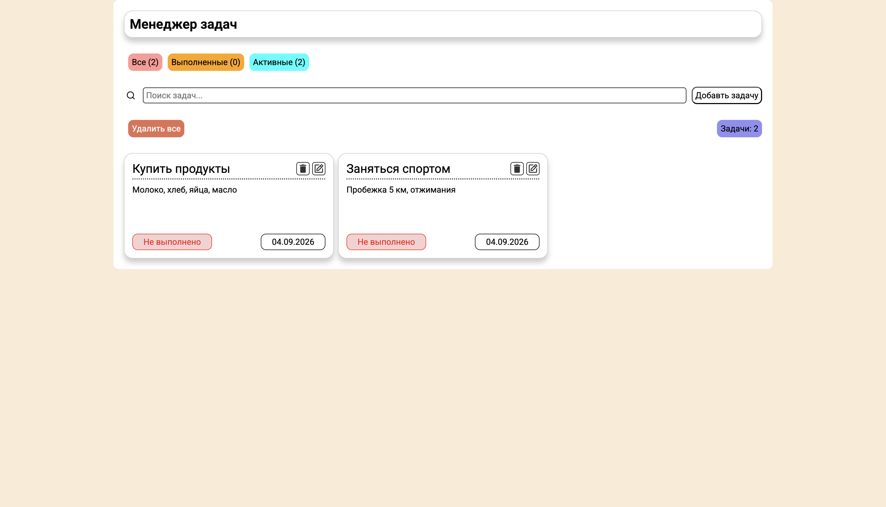

# Менеджер задач (Manager Task)

Минималистичное приложение для управления задачами с поддержкой CRUD-операций, фильтрации и поиска.

## Зачем этот проект?

Приложение помогает организовать ежедневные задачи: не забывать о делах, отслеживать прогресс и ничего не упускать.

## Скриншот




## Технологии

- React 18 — интерфейс и логика приложения
- JSX — синтаксис для описания интерфейса
- React Hooks — useState, useEffect, createContext
- Context API — глобальное состояние
- SCSS — стилизация (БЭМ, адаптив)
- JSON Server — фейковый REST API для бэкенда
- Vite — сборка и разработка
- ESLint — проверка кода
- HTML5
- БЭМ — методология именования классов

## Функционал

- Создание задач с названием и описанием
- Редактирование существующих задач
- Удаление задач (по одной или всех сразу)
- Отметка о выполнении (статус)
- Поиск по названию
- Фильтрация по статусу:
- Все
- Выполненные
- Активные
- Полностью адаптивный интерфейс
- Данные сохраняются на сервере (JSON Server)

## Как запустить

1. **Клонируй репозиторий:**

```bash
git clone https://github.com/J1NKS12/Manager-task.git
cd "Manager Task"
```

2. **Установи зависимости**

```bash
npm install
```

3.  **Запусти фронтенд**

```bash
npm run dev
```

4.  **В отдельном терминале запусти JSON Server**

```bash
npx json-server --watch json/db.json --port 8000
```

5.  Открой приложение

Перейди по ссылке: [http://localhost:5173](http://localhost:5173)
